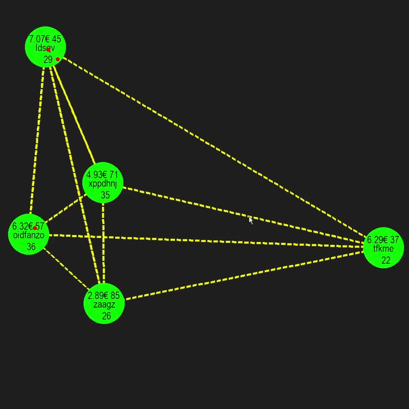

# EcoSim: A Live Market and Population Simulator in Python

I built this simulation using Python and Pygame because I wanted to see how a free economy works when it is run by types of people. In this simulation I created a marketplace where prices change right before your eyes based on how many people are buying how much stuff is available and how people move around.

## How the Simulation Works

The heart of this project is a system where every citizen makes their own money choices based on who they're

* Savers: Savers try to keep their money safe. Savers only buy things when the prices in the market get low enough.

* Impulsive Citizens: Impulsive Citizens do not care about inflation. Impulsive Citizens spend their money soon as they get it.

* Entrepreneurs: Entrepreneurs act as traders. Entrepreneurs look at the map to find price differences between cities. Entrepreneurs also look at how they have to travel to see if the profit is worth the trip.

* Farmers: Farmers focus on making things. Farmers make stock and eat a little bit of that stock so they can stay alive.

### Dynamic Economy Logic

Prices in each city do not stay the same. I made the prices change using a rule: price = 10 * (population / stock). If many people live in one city and there is not enough stuff the prices go up. If there is much stuff and not enough people buying the prices go down on their own.

### Routing and Pathfinding

To help the entrepreneurs move around the engine uses math.hypot to find the distance between cities. I used a Lambda sorting function so the entrepreneurs can decide if the profit from a sale is bigger than the cost of traveling to that city.

## Tech Stack and Architecture

* Language: Python 3

* Graphics Engine: Pygame (this handles the pictures the lines between cities and the population density metrics)

* Core Logic: Native Math and Random modules for the decision trees

* Design Patterns: I used Object-Oriented Programming (OOP) to keep the code organized into different files, like main.py, people.py and ciudades.py

---

You should feel free to clone the repository. You can change the formulas or add new types of people to see how the market reacts.
